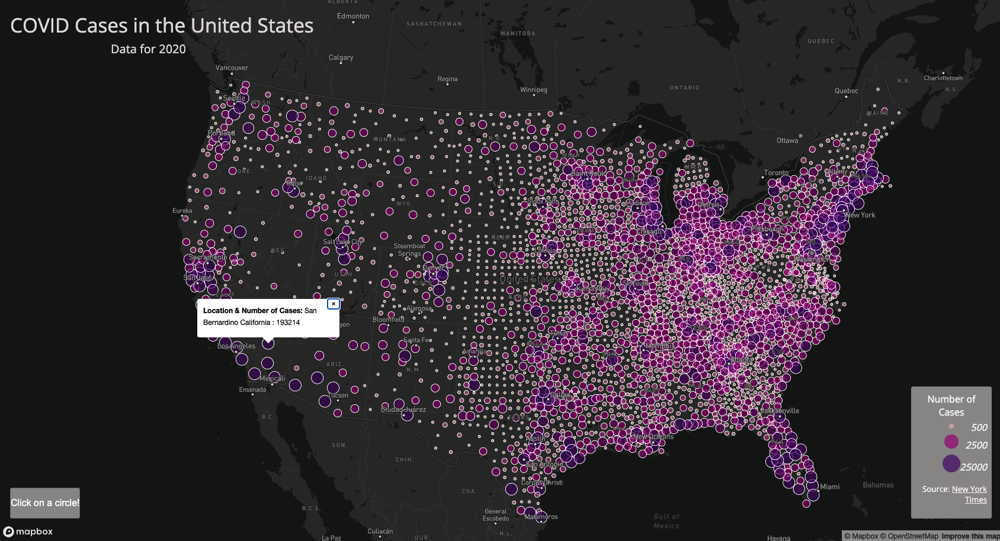

# COVID-19 Cases and Rates in the USA
## Data of 2020

This project represents rates and number of cases of COVID-19 pandemic in the USA in 2020. The data is depicted in two different maps.

* Choropleth map which represents case rates per 1000 people in a county
* Dot Density map which represents number of cases 

### Links to the maps

[Map1: COVID-19 Rates in the US in 2020 per county](https://anushmr.github.io/US-COVID-Data-of-2020/map1.html)

[Map2: COVID-19 Case numbers in the US in 2020 per county](https://anushmr.github.io/US-COVID-Data-of-2020/map2.html)

### Screenshots

### Libraries

* [Mapbox](https://mapbox.com)
* [Google Font](https://fonts.google.com/)
* [Mapshaper](https://mapshaper.org/)

### Data Sources
* [New York Times](https://github.com/nytimes/covid-19-data/blob/43d32dde2f87bd4dafbb7d23f5d9e878124018b8/live/us-counties.csv)
* [2018 ACS 5 Year Estimate](https://data.census.gov/cedsci/table?g=0100000US%24050000&d=ACS%205-Year%20Estimates%20Data%20Profiles&tid=ACSDP5Y2018.DP05&hidePreview=true)
* [U.S. Census Bureau Cartographic Boundary Files - Shapefile](https://www.census.gov/geographies/mapping-files/time-series/geo/carto-boundary-file.html)

### Acknowledgement and Credits

This project is a part of [GEOG 458 Advanced Digital Geographies](https://github.com/jakobzhao/geog458) course at the [University of Washington Department of Geography](https://geography.washington.edu/). 
The course guidalines are created by [Professor Bo Zhao](https://geography.washington.edu/people/bo-zhao) with assistance of [Steven Bao](https://geography.washington.edu/people/steven-bao) and [Jiaxin Feng](https://geography.washington.edu/people/jiaxin-feng). 